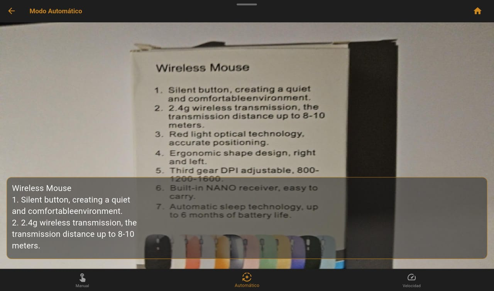
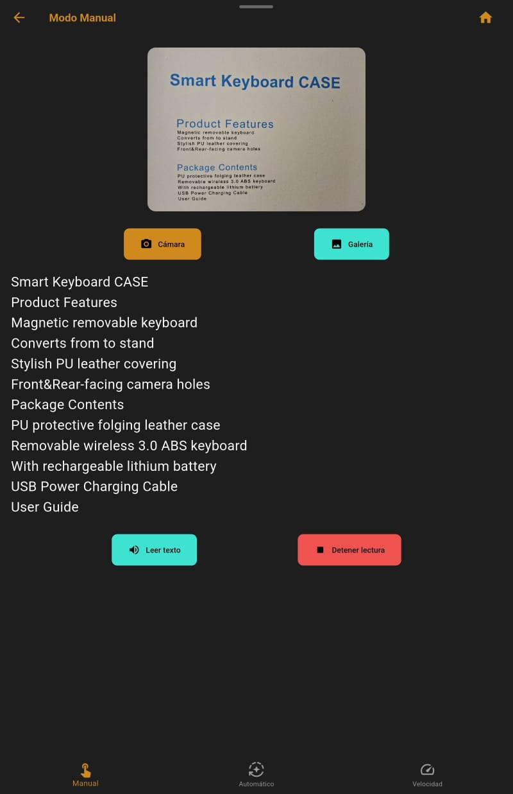

# OCR - Reconocimiento Óptico de Caracteres

Aplicación de Flutter que permite a los usuarios capturar, seleccionar una imagen o grabar, extraer el texto contenido (OCR) y reproducirlo en voz (TTS).

- Reconocimiento de texto en tiempo real utilizando `google_mlkit_text_recognition`.

- Lectura de texto extraído con `flutter_tt`.

